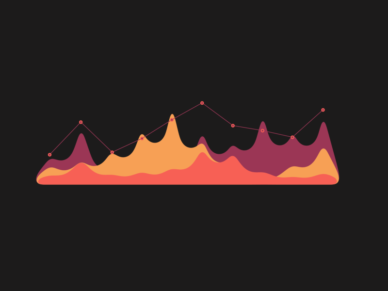

# Hi 👋, I'm **Jaqueline**

  

<h3 align="center">
  Computer Science | Development & Innovation | Automation | PMO | Robotics
</h3>

---

## 🚀 About Me

I'm a Computer Science student focused on **technology, innovation, automation, and project management**.

Currently working in **Development & Innovation at Fundação José Silveira**, contributing to technological solutions, process automation, software development, and innovation projects.

My work combines **software development, automation, agile methodologies, data analysis, and project management**, transforming processes and ideas into practical technological solutions.

My main methodology currently is **Scrum**, using agile practices to organize projects, prioritize tasks, collaborate with teams, and continuously deliver improvements.

  

### 🔭 Currently focused on

- Development & Innovation at **Fundação José Silveira**
- **Process Automation**
- Software Development
- **Scrum & Agile Methodologies**
- Robotics & Artificial Intelligence
- Computer Vision
- Data Analysis
- UX/UI
- IoT & Embedded Systems

### 🌱 Currently learning

- Big Data
- Distributed Systems
- Computer Vision
- Artificial Intelligence
- Software Architecture
- Intelligent Automation

### 🤝 I'm interested in

Collaborating on projects involving **technology, automation, robotics, artificial intelligence, innovation, and social impact**.

---

  

## 🛠️ Languages & Tools

  
  
  
  
  
  
  
  
  
  
  
  
  

  
  
  

---

## 💻 Development & Innovation

My current work is centered around building and improving technological solutions through:

- Process Automation
- Robotics & AI
- Software Development
- Data Analysis
- IoT & Embedded Systems
- UX/UI
- Project Management
- Scrum & Agile

  

---

## 📊 GitHub Stats

  
  

  

  

---

## 🎯 Goals & Projects

I'm continuously developing projects that connect **software, hardware, automation, and innovation**.

My goal is to build solutions that are technically efficient, scalable, and capable of generating real-world impact.

  

---

## 🌐 Connect with me

<table align="center">
  <tr>
    <td>
      
    </td>
    <td>
      
    </td>
    <td>
      
    </td>
    <td>
      
    </td>
  </tr>
</table>

---

  

  <i>"Turning ideas into technology, and technology into solutions."</i>

  ⭐ From <a href="https://github.com/jaquilunu">jaquilunu</a>

