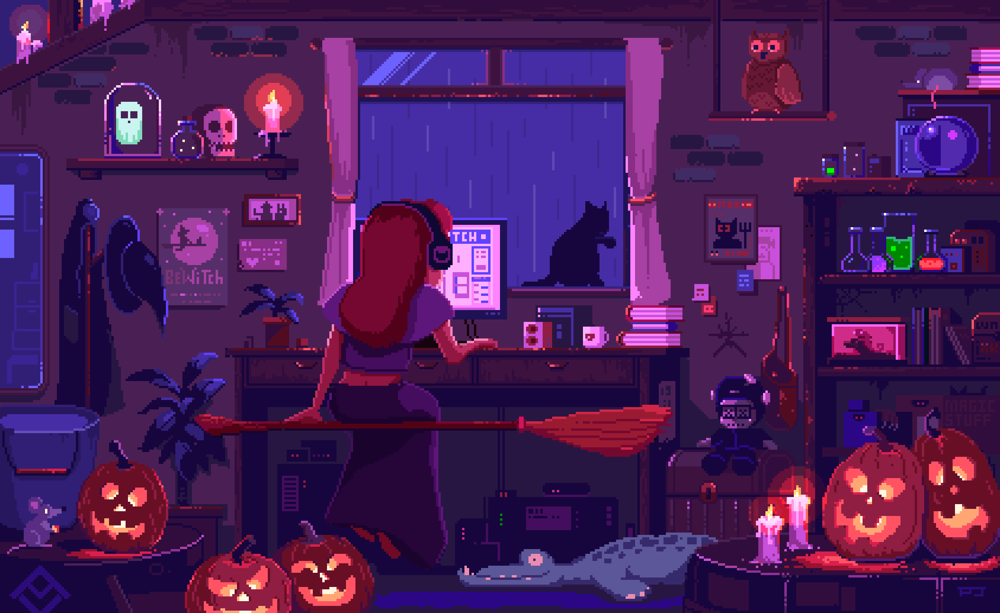

<h1 align="center">Olá 👋, eu sou Jaqueline</h1>

<table>
<tr>
<td width="60%" valign="middle">

<h3>Ciência da Computação | Desenvolvimento e Inovação | Automação | PMO | Robótica</h3>

Sou estudante de <strong>Ciência da Computação</strong>, com foco em tecnologia, inovação, automação e gerenciamento de projetos.

Atualmente atuo em <strong>Desenvolvimento e Inovação na Fundação José Silveira</strong>, contribuindo para soluções tecnológicas, automação de processos, desenvolvimento de software e projetos de inovação.

Meu trabalho combina <strong>desenvolvimento de software, automação, metodologias ágeis, análise de dados e gerenciamento de projetos</strong>, buscando transformar processos e ideias em soluções tecnológicas práticas.

Atualmente, minha principal metodologia de trabalho é o <strong>Scrum</strong>, utilizando práticas ágeis para organizar projetos, priorizar tarefas, colaborar com equipes e entregar melhorias continuamente.

</td>

<td width="40%" align="center" valign="middle">

  

<strong>Transformo ideias em realidade</strong>

</td>
</tr>
</table>

  

## 🚀 Atualmente

- Desenvolvimento e Inovação
- Automação de processos
- Desenvolvimento de software
- Inteligência Artificial
- Robótica
- IoT e sistemas embarcados
- Análise de dados
- UX/UI
- Gerenciamento de projetos
- Scrum & Agile

  

  

## 🛠️ Tecnologias

  
  
  
  
  
  
  
  
  
  

  Python · Java · C · C++ · JavaScript · Node.js · SQL · Arduino · Git · Figma

  

## 💻 Desenvolvimento e Inovação

Meu trabalho é voltado para a construção e melhoria de soluções tecnológicas por meio de:

- Automação de processos
- Desenvolvimento de software
- Robótica e Inteligência Artificial
- IoT e sistemas embarcados
- Análise de dados
- UX/UI
- Gerenciamento de projetos
- Scrum e metodologias ágeis

  

  

## 📊 GitHub

  
  

  

  

## 🎯 Projetos & Interesses

Tenho interesse em projetos que conectem:

  <strong>Software + Automação + Hardware + Inteligência Artificial + Inovação</strong>

Busco desenvolver soluções tecnológicas que sejam eficientes, escaláveis e capazes de gerar impacto no mundo real.

  

  

## 🌐 Conecte-se comigo

  

  <i>Transformo ideias em realidade</i>

