# Olá 👋, eu sou **Jaqueline**

<table>
<tr>
<td width="55%" valign="middle">

### Ciência da Computação | Desenvolvimento e Inovação | Automação | PMO | Robótica

Sou estudante de **Ciência da Computação**, com foco em **tecnologia, inovação, automação e gerenciamento de projetos**.

Atualmente atuo em **Desenvolvimento e Inovação na Fundação José Silveira**, trabalhando com soluções tecnológicas, automação de processos, desenvolvimento de software e projetos de inovação.

Meu trabalho combina **desenvolvimento de software, automação, análise de dados, metodologias ágeis e gerenciamento de projetos**, buscando transformar processos e ideias em soluções práticas.

Atualmente, minha principal metodologia de trabalho é o **Scrum**, utilizando práticas ágeis para organização, priorização, colaboração e entrega contínua.

</td>

<td width="45%" align="center">

 

### **Transformo ideias em realidade.**

</td>
</tr>
</table>

---

## 🚀 Atualmente

- Desenvolvimento e Inovação
- Automação de processos
- Desenvolvimento de software
- Inteligência Artificial
- Robótica
- IoT e sistemas embarcados
- Análise de dados
- UX/UI
- Gerenciamento de projetos
- Scrum & Agile

---

## 🛠️ Tecnologias

`Python` · `Java` · `C` · `C++` · `JavaScript` · `Node.js` · `SQL` · `Arduino` · `Git` · `Figma`

---

## 📊 GitHub

  
  

---

## 🎯 Projetos & Interesses

Tenho interesse em projetos que conectem:

**Software + Automação + Hardware + Inteligência Artificial + Inovação**

Busco desenvolver soluções tecnológicas que sejam eficientes, escaláveis e capazes de gerar impacto no mundo real.

  

---

## 🌐 Conecte-se comigo

---

  <i>Transformo ideias em realidade.</i>

